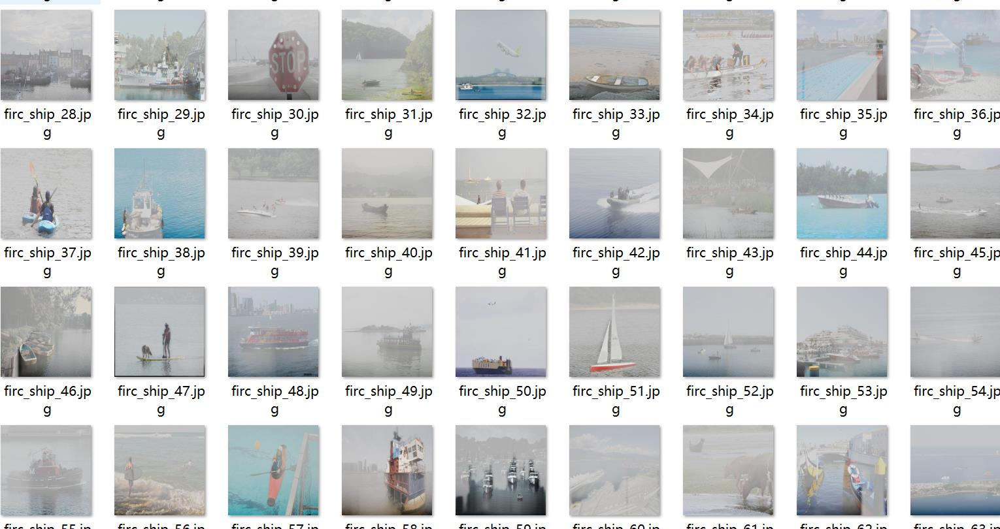
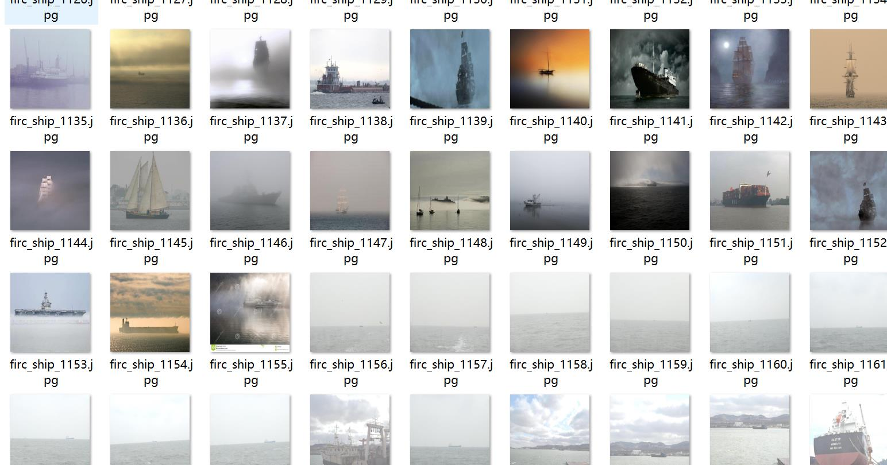
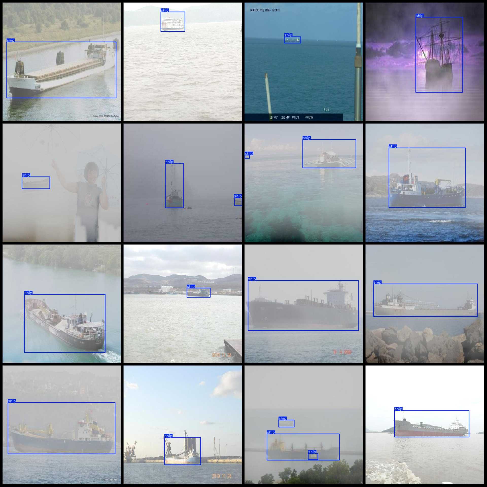
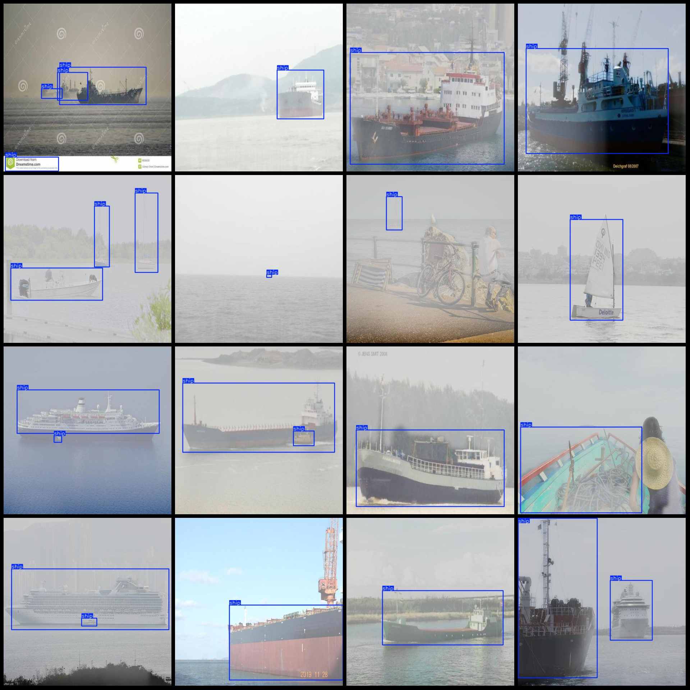

# Foggy Weather Ship Detection Dataset VOC+YOLO Format with 1386 Images and 1 Classification

The dataset format is as follows: Pascal VOC format + YOLO format (excluding the split path in the txt file, only containing jpg images along with the corresponding VOC format xml files and YOLO 
format txt files).

Number of images (total jpg files): 1386
Number of annotations (total xml files): 1386
Number of annotations (total txt files): 1386
Number of classification categories: 1
Classification category name: ["ship"]
Number of bounding box instances for each category:
ship bounding box count = 2599
Total bounding box count = 2599
Number of images per category:
ship per image count = 1386
Image resolution: 640x640
Annotation tool used: labelImg
Annotation rule: draw a bounding box around the category.
Important note: The dataset does not include a training/validation/test split; you will need to manually divide the data.
Special declaration: This dataset does not guarantee the accuracy of the trained models or weight files.
Image preview:
Annotation example:

## Images

Here is a pay link on Stripe ( https://buy.stripe.com/3cs8yP7sY87d0vu9AB ). Please contact me lonlonago@foxmail.com after funding $89, and I will send you a complete data files , thank you!

